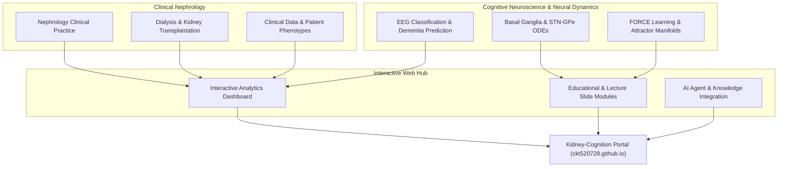

# 🩺 Kidney & Cognition Lab (朱國大醫師個人互動式門戶)

[](https://opensource.org/licenses/MIT)
[](https://github.com/ckt520728)
[](https://github.com/ckt520728)
[](https://ckt520728.github.io/kidney-cognition-lab/)

Welcome to the **Kidney & Cognition Lab** interactive web portal created by **Kwo-Ta Chu, MD, PhD (朱國大醫師)**. This platform bridges clinical nephrology practice with computational cognitive neuroscience and biosignal machine learning.

---

## 🏛️ System & Research Architecture



---

## 🔬 Core Focus Areas

1. **Clinical Nephrology**: Electrolyte disorders, chronic kidney disease (CKD), hemodialysis, and transplantation immunology.
2. **Computational Neuroscience**: Leaky Integrate-and-Fire (LIF) neural models, Basal Ganglia limit cycle attractors, and DBS intervention dynamics.
3. **EEG & Biosignal ML**: EEG machine learning pipelines for early classification and longitudinal tracking of cognitive impairment and dementia.

---

## 📖 Citation

If you reference this lab portal or research framework in academic work, please cite:

```bibtex
@misc{chu2026kidneycognition,
  author = {Chu, Kwo-Ta},
  title = {Kidney \& Cognition Lab: Interactive Academic Portal \& Research Hub},
  year = {2026},
  publisher = {GitHub},
  journal = {GitHub repository},
  howpublished = {\url{https://github.com/ckt520728/kidney-cognition-lab}}
}
```

---

## 📄 License

This project is licensed under the [MIT License](LICENSE).
